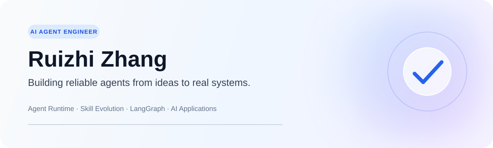

  <a href="./README.md">English</a> · <strong>简体中文</strong>

  

  
  
  

## 关于我

我是 **张睿志（Ruizhi Zhang）**，华东师范大学计算数学硕士研究生，与上海交通大学联合培养。

我专注于构建不止停留在演示阶段的 AI Agent：具备清晰工作流、可靠工具调用、可控上下文和可观测执行过程的真实系统。近期工作涵盖 **Agent 自我改进与 Skill 演化**、**多智能体编排**和**AI 应用全栈开发**。

- 🧠 扎实的数学基础，本科成绩排名前 3%
- 🛠️ 擅长将新技术快速落地为可运行、可测试的系统
- 🔍 关注 Agent Runtime、上下文工程、Memory、RAG、工具调用与评测
- 🚀 寻找 **2027 届 AI Agent 工程 / 大模型应用方向**岗位

## 我的方向

<table>
  <tr>
    <td width="50%" valign="top">
      <h3>Agent 自我改进</h3>
      
设计从长会话和工具调用轨迹中提取可靠证据、定位失败原因并生成可审查 Skill 更新的工作流。

      
<code>轨迹分析</code> <code>Skill 演化</code> <code>上下文工程</code>

    </td>
    <td width="50%" valign="top">
      <h3>多智能体应用</h3>
      
基于 LangGraph 构建数据分析、文档自动化、UI 生成和规划工作流等多场景 Agent。

      
<code>LangGraph</code> <code>RAG</code> <code>工具调用</code> <code>Memory</code>

    </td>
  </tr>
  <tr>
    <td width="50%" valign="top">
      <h3>AI 应用工程</h3>
      
覆盖 Agent 编排、后端服务、数据存储与 Web 界面的端到端原型交付。

      
<code>Python</code> <code>FastAPI</code> <code>React</code> <code>SQL</code>

    </td>
    <td width="50%" valign="top">
      <h3>AI for Science</h3>
      
将机器学习和深度学习用于复杂物理系统，包括反应堆参数推断与工业预测。

      
<code>机器学习</code> <code>时间序列</code> <code>科学机器学习</code>

    </td>
  </tr>
</table>

## 精选经历

**快手 · AI Agent 工程实习生**  
参与面向 Coding Skill 的 Agent 自学习流程建设，覆盖证据定位、失败归因、可复用知识提取和受控 Skill 演化；研究长上下文压缩、运行时工作流及生成变更的质量治理。

**上汽集团 / 智己汽车 · AI Agent 工程实习生**  
带领实习生小组使用 LangGraph 构建多场景 Agent，开发数据分析与文档自动化工作流，并探索从产品需求到 UI 与功能交付的端到端路径。

**数据驱动风控建模 · 算法负责人**  
面向严重类别不平衡与时间分布漂移问题构建稳健信用风险模型，开展特征稳定性、可解释建模及基于 Focal Loss 的优化。

## 技术栈

| 方向 | 工具与概念 |
| --- | --- |
| Agent 系统 | LangGraph、LangChain、RAG、工具调用、Memory、多智能体编排、Agent 评测 |
| 工程开发 | Python、TypeScript、FastAPI、React、Vite、PostgreSQL、SQLite、Git |
| 机器学习 | XGBoost、LightGBM、特征工程、不平衡学习、时间序列建模 |
| 当前关注 | Agent Runtime、上下文工程、Skill 演化、Coding Agent、Agent 可观测性 |

## 科研经历

- 以第一作者身份开展面向复杂物理系统的深度学习、强化学习与生成式建模研究，成果发表于 *Nuclear Science and Techniques*。
- 参与乏燃料后处理分配比预测研究，成果发表于《原子能科学技术》。
- 在中国核学会年会上报告《三种机器学习算法在反应堆运行参数推断中的比较研究》。

## 近期探索

- 从真实 Agent 轨迹中实现更可靠的 Skill 演化
- 从长程、工具密集型会话中高效检索证据
- 规划、执行、审查与确定性验证之间的运行时边界
- Agentic Coding 系统的实用评测方法

  欢迎交流 AI Agent、大模型应用与 2027 届校招机会。

